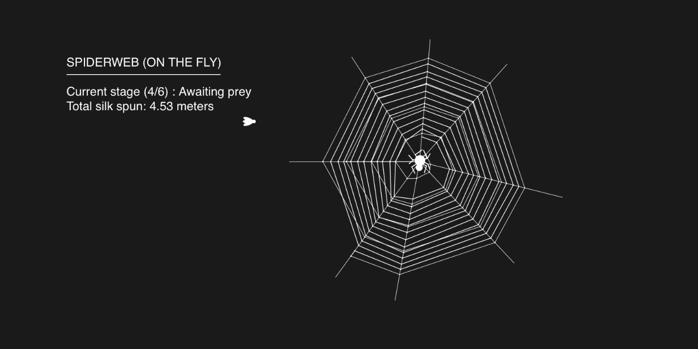

# Spiderweb (on the Fly)
“Spiderweb (on the Fly)” is a real-time software simulation of an orb-weaver (garden spider) web being built. Each web created is unique, just like those of spiders!

## Live site
- https://ashmystic.github.io/spiderweb-on-the-fly
- Click on the double arrow ">>" button in the top-right to expand to fullscreen mode. This button also restarts the animation.

## Simulation steps
Below is an overview of the steps involved in creating the web. These correspond to the stages displayed in the top-left corner of the simulation.

1. **Creating radii**

The spider lays out the radii lines or "spokes" that will support the web. The number of lines differs depending on the environment and available connection points.

In the simulation a random number is picked between 6 and 9 to determine the number of radii lines. These are then placed at random angles around the cwentral "hub".

2. **Creating spiral**

The spider starts in the center of the web at the hub and lays out a spiraling strand that is used as a guide for the finished web.

The simulation keeps track of the current radii line, as well as the last point connected to on each radii line. This is how the simulated spider knows where to go next!

3. **Creating sticky web**

The spider starts on the outside of the web and works its way in, laying a strand of sticky web that is able to ensnare insects. This is in contrast to the non-sticky structural web used for building the radii lines and spiral.

The simulation creates the sticky net in a similar fasion to how it creates the spiral, just in reverse and with a few differing constants.

4. **Awaiting prey**

The spider returns to the hub, where it is roughly equidistant to all points on the web and can easily detect vibrations. It rests and waits here until it detects an insect.

In the simulation a little fly wanders into the scene and stops at a random point on the web. Fun fact: the fly's path follows a sine wave!

5. **Wrapping prey**

With the insect stuck, the spider quickly scurries over and wraps it in more silk to ensure it stays trapped.

6. **Digesting**

If the web is still intact, the spider will return to the hub and wait for more insects.

After this the simulation resets so that you can watch another unique web construction!

## Code Overview
The simulation is written in front-end JavaScript and utilizes the [Paper.js](http://paperjs.org) vector graphics scripting framework.

The code starts in `main.js` where the `window.onload` function is defined. In this function the `Spiderweb_Manager` class (`spiderweb_manager.js`) is instantiated and initialized.

`Spiderweb_Manager` is where most of the simulation logic is. It is a wrapper for the Finite State Machine (FSM) that determines what part of the simulation is running. The FSM is a simple set of 5 boolean variables (`areRadiiDrawn`, `isSpiralDrawn`, `isNetDrawn`, `isFlyCaught`, `isFlyWrapped`) that correspond to the 6 steps in the section above. `Spiderweb_Manager` also creates and manages a `Spider` (`spider.js`) and `Fly` (`fly.js`) object.

The most complex part of the simulation is the vector geometry calculations (figuring out where the next points and lines will go). Paper.js has vector geometry built-in, and their website has a helpful article on learning how to use it [here](http://paperjs.org/tutorials/geometry/vector-geometry/). You may notice that I made my own `Vector_Helper` class for vector operations. This is because the built-in "automatisms" like `point1 + point2` don't work when using JavaScript directly rather than the default PaperScript (see [this](http://paperjs.org/tutorials/getting-started/using-javascript-directly/) article).

## References
- ["Early stages of orb web construction in Araneus diadematus"](https://bio.staern.li/pdf/zschokke1996rsz.pdf)
- [Paperjs.org](http://paperjs.org/)
